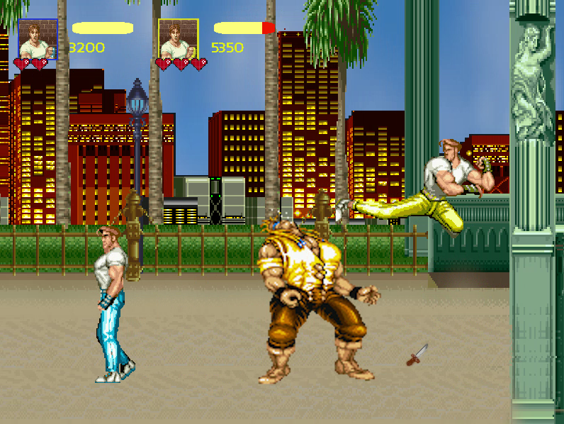

# Final Fight - Cliente

    <b>Grupo Eclipsados</b> 
    
  

Juego estilo ['Final Fight'](https://www.youtube.com/watch?v=KL22s0MPiA4), con soporte hasta 4 jugadores en simultaneo por red, configuracion por XML y mas.

Muestra de una partida tipica con dos jugadores en linea:

Este repositorio documenta el desarrollo de las fases 2 y 3 del proyecto Final Fight, para la materia Taller de Programacion I de la Facultad de Ingenieria de la UBA. Proyecto realizado el segundo cuatrimestre de 2019.

La ejecucion del codigo aqui presentado es dependiente de su respectivo servidor, disponible en el repositorio [Eclipsados-Servidor](https://github.com/nachonitz/Eclipsados-Servidor).

Ver la seccion 'Releases' para mas informacion acerca de ejecucion, versiones y compatibilidad.

Para ver los primeros pasos del proyecto (fase 1), puede verse el [primer repositorio aqui](https://github.com/Franco-Giordano/FIUBA-TdP1-Eclipsados).
